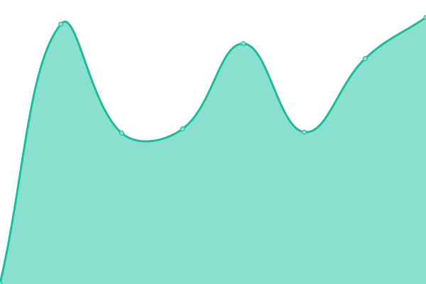

# [📈 Live Status](https://status.kolibri.dev): <!--live status--> **🟩 All systems operational**

This repository contains the open-source uptime monitor and status page for [Kolibri Solutions](https://kolibrisolutions.nl), powered by [Upptime](https://github.com/upptime/upptime).

With [Upptime](https://upptime.js.org), you can get your own unlimited and free uptime monitor and status page, powered entirely by a GitHub repository. We use [Issues](https://github.com/KolibriSolutions/monitoring/issues) as incident reports, [Actions](https://github.com/KolibriSolutions/monitoring/actions) as uptime monitors, and [Pages](https://status.kolibri.dev) for the status page.

<!--start: status pages-->
<!-- This summary is generated by Upptime (https://github.com/upptime/upptime) -->
<!-- Do not edit this manually, your changes will be overwritten -->
<!-- prettier-ignore -->
| URL | Status | History | Response Time | Uptime |
| --- | ------ | ------- | ------------- | ------ |
|  [TU/e Marketplace](https://marketplacetue.nl/) | 🟩 Up | [tu-e-marketplace.yml](https://github.com/KolibriSolutions/monitoring/commits/HEAD/history/tu-e-marketplace.yml) | 

 606ms
     
 | 

<a href="https://status.kolibri.dev/history/tu-e-marketplace">100.00%</a>
    

|  [BEP Marketplace](https://bep.ele.tue.nl/) | 🟩 Up | [bep-marketplace.yml](https://github.com/KolibriSolutions/monitoring/commits/HEAD/history/bep-marketplace.yml) | 

 842ms
     
 | 

<a href="https://status.kolibri.dev/history/bep-marketplace">100.00%</a>
    

|  [Master Marketplace](https://master.ele.tue.nl/) | 🟩 Up | [master-marketplace.yml](https://github.com/KolibriSolutions/monitoring/commits/HEAD/history/master-marketplace.yml) | 

 887ms
     
 | 

<a href="https://status.kolibri.dev/history/master-marketplace">100.00%</a>
    

|  [MSc Graduation Project Assessment Form](https://examination.master.ele.tue.nl/) | 🟩 Up | [m-sc-graduation-project-assessment-form.yml](https://github.com/KolibriSolutions/monitoring/commits/HEAD/history/m-sc-graduation-project-assessment-form.yml) | 

 1038ms
     
 | 

<a href="https://status.kolibri.dev/history/m-sc-graduation-project-assessment-form">100.00%</a>
    

|  [Coursebrowser](https://coursebrowser.nl/) | 🟩 Up | [coursebrowser.yml](https://github.com/KolibriSolutions/monitoring/commits/HEAD/history/coursebrowser.yml) | 

 607ms
     
 | 

<a href="https://status.kolibri.dev/history/coursebrowser">100.00%</a>
    

<!--end: status pages-->

[**Visit our status website →**](https://status.kolibri.dev)

## 📄 License

- Powered by: [Upptime](https://github.com/upptime/upptime)
- Code: [MIT](./LICENSE) © [Anand Chowdhary](https://anandchowdhary.com), supported by [Pabio](https://pabio.com)
- Data in the `./history` directory: [Open Database License](https://opendatacommons.org/licenses/odbl/1-0/)
